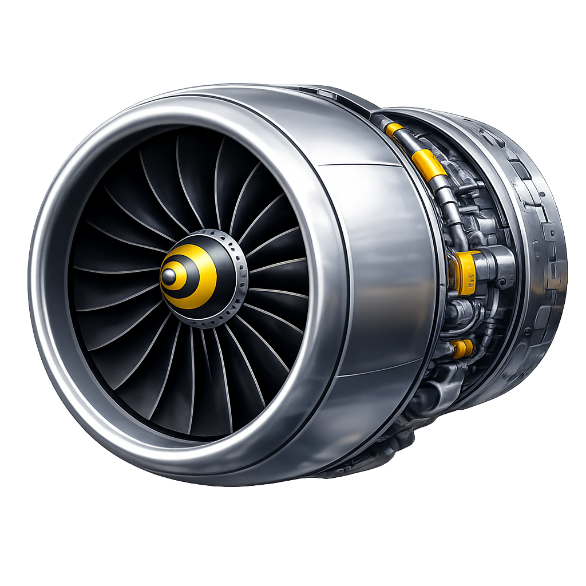

<p align="center">
  
</p>

# Turbofan

Turbofan is an opinionated batch processing framework for AWS. It orchestrates multi-step data pipelines using Step Functions, Batch, and CloudFormation. You define pipelines and steps in a declarative Ruby DSL, and Turbofan handles Docker packaging, infrastructure provisioning, fan-out at scale, concurrency control, cost tracking, and operational tooling. The single design principle: **a pipeline author writes business logic and schema declarations; everything else is generated.**

## Why Turbofan

Building batch processing pipelines on AWS typically requires creating 50+ files: thousands of lines of hand-written CloudFormation, multiple state machine definitions, Docker configurations, IAM policies, secrets management boilerplate, and compute environment setup. Turbofan solves four interrelated problems:

- **Scale**: Process millions of items in parallel. Turbofan uses AWS Batch array jobs to fan out up to 10,000 children per parent, with automatic chunking beyond that.
- **Resource contention**: Multiple pipelines hitting the same database simultaneously cause connection storms. Turbofan uses AWS Batch consumable resources to enforce concurrency limits at the scheduler level — jobs wait in `RUNNABLE` until a slot opens, with zero application-level coordination.
- **Cost visibility**: Turbofan tags every resource — EC2 instances, S3 objects, log groups — with pipeline, step, stage, and execution identifiers, making costs queryable via AWS Cost and Usage Reports.
- **Polyglot execution**: Orchestrate any Docker container — Python, Node, Rust, Go — while keeping the pipeline definition in Ruby. Each step runs in its own container with its own dependencies.

## Architecture

```
User Code (Steps, Pipelines, Resources)
        |
        v
+---------------------------------+
|           DSL Layer             |
|  Step, Pipeline, Router,        |
|  Resource, ComputeEnvironment   |
|  (modules included in classes)  |
+-----------------+---------------+
                  |
                  v
+---------------------------------+
|         DAG Builder             |
|  TaskFlow DSL -> DagStep graph  |
|  Schema edge validation         |
|  Pipeline composition           |
+-----------------+---------------+
                  |
            +-----+------+
            v            v
      +----------+ +----------+
      | CFN Gen  | | ASL Gen  |
      | (infra)  | | (orch)   |
      +----------+ +----------+
            |            |
            v            v
+---------------------------------+
|        Deploy Layer             |
|  StackManager, ImageBuilder,    |
|  PipelineLoader, Execution      |
+---------------------------------+
            |
            v
+---------------------------------+
|        Runtime Layer            |
|  Wrapper, Context, Payload,     |
|  ResourceAttacher, FanOut,      |
|  Logger, Metrics, Lineage       |
+---------------------------------+
            |
            v
+---------------------------------+
|           CLI Layer             |
|  Thor commands: deploy, run,    |
|  status, history, check, cost,  |
|  resources, logs, destroy,      |
|  rollback, ce, new, add         |
+---------------------------------+
```

### AWS Service Mapping

| Turbofan Concept | AWS Service |
|-----------------|-------------|
| Pipeline orchestration | Step Functions (state machine) |
| Step execution | Batch (job definitions, job queues, array jobs) |
| Compute pools | Batch compute environments (EC2 Spot) |
| Fan-out chunking | Lambda (splits input, writes chunks to S3) |
| Concurrency control | Batch consumable resources |
| Infrastructure | CloudFormation (generated templates) |
| Container images | ECR (one repo per step) |
| Data interchange | S3 (step I/O, fan-out chunks) |
| Secrets | Secrets Manager |
| Scheduling | EventBridge rules |
| Logging | CloudWatch Logs (one group per step) |
| Metrics | CloudWatch Metrics (auto + custom) |
| Dashboards | CloudWatch Dashboards (auto-generated) |
| Notifications | SNS (pipeline completion/failure) |
| Cost attribution | Resource tagging + CUR 2.0 |

### Key Design Decisions

#### 1. Strict schemas

Every step must declare `input_schema` and `output_schema`. Validated at DAG-build time (edge compatibility in `dag.rb`) and runtime (data validation in `runtime/wrapper.rb`) via json_schemer (JSON Schema draft 2020-12). Catches incompatibilities before deployment.

#### 2. Stateless discovery

`ObjectSpace.each_object(Class)` with `Object.const_get` liveness guard (see `lib/turbofan.rb`). No registry, no configuration. If a class includes `Turbofan::Step`, it's discoverable. This makes testing trivial — define a class, and it's immediately available.

#### 3. No DAG memoization

`turbofan_dag` builds fresh each call (see `pipeline.rb`). Prevents stale state across test runs and reloads.

#### 4. Batch-only fan-out

AWS Batch array jobs exclusively (see `generators/asl.rb`). No Step Functions Map/DistributedMap. Spot pricing (60-90% savings) and scales to 10,000 children per parent.

#### 5. `batch_size:` replaces `concurrency:`

A chunking Lambda packs N items per array child (see `dag.rb`, `cloudformation/chunking_lambda.rb`). Concurrency is controlled by consumable resources and compute environment `maxvCpus`, not Step Functions limits. This separates the question "how many items per container?" from "how many containers run concurrently?"

#### 6. Content-addressed builds

Docker image tags are SHA256 hashes of step source, schemas, and external dependencies (see `deploy/image_builder.rb`). Only changed steps rebuild and redeploy. This enables idempotent builds and deterministic rollbacks. When a shared service file changes, only the steps that depend on it are rebuilt.

#### 7. Resource abstraction

Database connections, secrets, and consumable resources are declared as `Turbofan::Resource` classes (see `resource.rb`, `runtime/resource_attacher.rb`). Runtime attachment is automatic. Concurrency is managed by AWS Batch consumable resources. The resource type is `REPLENISHABLE` — tokens are returned when jobs complete.

#### 8. Cost visibility through tagging

All resources tagged with `turbofan:*` namespace (see `generators/cloudformation.rb`). CUR 2.0 queried via DuckDB for per-pipeline, per-step, per-execution cost breakdown.

#### 9. Ephemeral testing

No local emulation of AWS services, no mocking Step Functions. Test by deploying to temporary stages (see `spec/turbofan/integration/online/`). The test environment is a real stack with real Batch jobs — just pointed at a test stage with limited input. This avoids simulation complexity and catches real integration issues.

#### 10. Envelope-based interchange

Data flows between steps as **envelopes** — JSON objects with the shape `{"inputs": [...]}`. The `"inputs"` key always contains an array, regardless of whether the step processes one item or thousands. This uniform shape simplifies serialization, fan-out chunking, and cross-language interop (Python containers parse the same format).

The envelope is a transport concern — step authors never see it. The Ruby wrapper opens the envelope and passes the `inputs` array directly to `call(inputs, context)`. Any extra keys in the envelope beyond `"inputs"` (e.g., trace IDs, metadata from external containers) are accessible via `context.envelope`.

```
                    Envelope (transport)              Step (developer)
                    ┌─────────────────────┐
S3 / env var  ───▶  │ {"inputs": [a, b]}  │  ───▶  call([a, b], context)
                    │                     │
                    │ Extra keys → context.envelope
                    └─────────────────────┘
```

This separation means:
- Steps always receive arrays — no special-casing for single items vs. batches vs. fan-in joins
- The interchange format can carry metadata without changing the step API
- External containers (Python, Rust, etc.) read `envelope["inputs"]` and write `{"inputs": [...]}` — one protocol for all languages

### Data Flow Between Steps

**Small payloads (<128KB):** Envelopes flow natively through Step Functions state. Debuggable in the AWS console.

**Large payloads (>128KB):** The framework auto-spills the envelope to S3 and passes a reference. The next step transparently receives the reconstituted data. The 128KB threshold provides safety margin below Step Functions' 256KB state limit.

**Fan-out input distribution:** Before a Batch array job, the framework writes each input item to S3 at `{pipeline}-{stage}/{execution_id}/{step_name}/input/{chunk}/{index}.json`. Each container reads its input by chunk and array index.

**Fan-out output collection:** Each container writes its return value to `{pipeline}-{stage}/{execution_id}/{step_name}/output/{chunk}/{index}.json`. After the array job completes, the framework collects outputs as an ordered list, reassembling across chunks in the correct original order. For large fan-outs, use `FanOut.each_output` to stream results without loading all into memory.

**Batch array job limit:** AWS caps array jobs at 10,000 items. For larger fan-outs, the framework auto-chunks into multiple array jobs, submitted as a Parallel state in Step Functions.

**Serialization format:** JSON envelopes. Safe across independent Gemfiles, debuggable, version-agnostic.

### Retry Strategy

The framework generates a production-grade `EvaluateOnExit` chain for all job definitions:

| Condition | Action | Counts toward retry limit? |
|-----------|--------|---------------------------|
| `Host EC2*` (Spot reclaim) | RETRY | No |
| Exit code `143` (SIGTERM) | RETRY | No |
| `Task failed to start*` (ECS placement) | RETRY | No |
| Exit code `0` (success) | EXIT | N/A |
| `CannotPullContainer*` (config error) | EXIT | N/A |
| `*` (application failure) | EXIT | Yes |

Infrastructure failures (Spot reclaim, SIGTERM, placement) are retried without counting toward the application retry limit. The `retries` DSL on the step class controls only application failure retries (default 3). Infrastructure retries use a higher limit (default 10).

#### Signal Handling

The container wrapper installs a SIGTERM handler for graceful Spot interruption:

1. Traps SIGTERM (sent ~2 minutes before Spot reclaim)
2. Sets `context.interrupted?` flag (checkable in long-running loops)
3. Logs the interruption with structured metadata
4. Cleans up NVMe temp directory
5. Exits with code 143 so the retry strategy recognizes it as infrastructure failure

### What's Deferred

- **Idempotency / checkpointing** — In a fan-out context (10,000 parallel jobs), defining "resume from where you left off" is complex. A step-level restart from the last successful step's S3 output is feasible; item-level retry within a fan-out requires per-item status tracking.
- **Conditional branching** — Step Functions Choice states for runtime if/else logic in the DAG. Would require a `branch` DSL primitive since native Ruby `if/else` can't capture both branches during static DAG construction.
- **Local development** — A `turbofan run-local STEP --input '{}'` command that bootstraps env vars and runs a step in-process without AWS.
- **Property-level DagProxy access** — `result.lat` for subfield selection from previous step output.
- **Python SDK** — MVP is `docker_image`. A Python SDK with resource access, schema validation, and DuckDB integration could come later.
- **OpenTelemetry** — Full tracing integration across the framework for distributed observability.

## How It Works

A turbofan pipeline is a directed acyclic graph (DAG) of **steps**. Each step is a Docker container that runs as an AWS Batch job. Steps communicate through S3: one step writes its output, the next step reads it as input.

The pipeline definition compiles into two things:

1. **A CloudFormation template** containing all AWS resources: ECR repositories, Batch job definitions, job queues, IAM roles, a Step Functions state machine, CloudWatch log groups, dashboards, and SNS topics. A shared S3 bucket (externally managed) is used for data interchange.
2. **An ASL (Amazon States Language) definition** describing the state machine that orchestrates step execution order, fan-out chunking, error handling, and notifications.

When you deploy, Turbofan builds Docker images for each step, pushes them to ECR with content-addressed tags (so unchanged steps aren't rebuilt), and creates/updates the CloudFormation stack. When you run, it starts a Step Functions execution that walks through the DAG.

```
┌──────────┐     ┌──────────┐     ┌──────────┐
│  Step A   │────▶│  Step B   │────▶│  Step C   │
│  (Ruby)   │     │ (Python)  │     │  (Rust)   │
└──────────┘     └──────────┘     └──────────┘
     │                │                │
     ▼                ▼                ▼
   S3: A/output    S3: B/output    S3: C/output
```

## Concepts

### Pipelines

A pipeline is a Ruby class that defines a name, optional schedule, and a DAG of steps. The `pipeline` block uses method calls to declare steps and wire them together by passing return values.

### Steps

A step is a Ruby class that declares compute requirements (CPU, RAM), resource dependencies, JSON schemas for input/output validation, and a `call(inputs, context)` method. Each step becomes a Batch job definition backed by a Docker container.

### Compute Environments

A compute environment is a shared EC2 instance pool managed by AWS Batch. CEs define instance types, spot pricing strategy, and scaling limits. They're deployed once and referenced by multiple steps across pipelines. You typically have a small number — compute-optimized, memory-optimized, GPU, etc.

### Dependencies (`uses` / `writes_to`)

Steps declare their dependencies with two methods:

- **`uses`** (or its alias `reads_from`) — the default. Grants **read-only / minimum** permissions. Accepts resource keys (symbols) or S3 URI strings.
- **`writes_to`** — escalation. Grants **read+write** permissions. Same argument types.

For Postgres resources, `uses :key` creates a readonly DuckDB `ATTACH`; `writes_to :key` creates a read-write `ATTACH`. For S3 URIs, `uses "s3://..."` generates read-only IAM policies; `writes_to "s3://..."` adds write permissions. For consumable-only resources (GPU quotas, rate limits), `uses :key` enforces a scheduling constraint with no database attachment.

### Resources

Resources are shared infrastructure that steps depend on — primarily database connections. A Postgres resource declares a Secrets Manager ARN for the connection string and a consumable quantity (e.g., 100 connections). At runtime, the connection is fetched and attached to DuckDB via `ATTACH`, making Postgres tables queryable through DuckDB SQL.

### Fan-Out

Fan-out distributes an array of items across parallel Batch array job children. You wrap a step call with `fan_out(step(input), batch_size: N)` where `N` is items per child. A Lambda function chunks the input array into S3, and each array job child reads its chunk by index.

The chunking Lambda reads its input from S3 — either the previous step's output (for mid-pipeline fan-outs) or the trigger input (for first-step fan-outs). **All data flows through S3, never through state machine payloads or env vars.**

#### Fan-out input format

The step preceding a fan-out must write its output as `{"items": [...]}` where each item is a small work unit. The chunking Lambda reads `items`, splits them into chunks of `batch_size`, and writes each chunk to S3.

**Fan-out after a step** (most common):

```ruby
pipeline do
  # discover writes {"items": [{"prefix": "aa"}, {"prefix": "ab"}, ...]}
  partitions = discover(trigger_input)
  fan_out(process(partitions), batch_size: 1)
end
```

The `discover` step's output is written to S3 as `{"items": [...]}`. The chunking Lambda reads it via S3 key `{execution_id}/discover/output.json`.

**Fan-out as the first step:**

```ruby
pipeline do
  fan_out(process(trigger_input), batch_size: 1)
end
```

The trigger input is passed directly to the chunking Lambda. Point it at S3:

```bash
turbofan start my_pipeline staging --input '{"items_s3_uri": "s3://bucket/partitions.json"}'
```

The S3 file must be `{"items": [...]}`:

```json
{"items": [{"prefix": "aa"}, {"prefix": "ab"}, {"prefix": "ac"}]}
```

The `items_s3_uri` must point to the pipeline's S3 bucket (`Turbofan.config.bucket`). The chunking Lambda validates both the URI prefix and the file shape — clear errors on any mismatch.

When the fan-out step has `size` definitions, Turbofan creates a **routed fan-out**: items are grouped by `_turbofan_size`, and each size gets its own Batch array job with the appropriate CPU/RAM allocation. See the [Routers](#turbofanrouter) section for details.

### Schemas

Steps declare JSON Schema files for input and output validation. At DAG build time, Turbofan verifies that each step's output schema provides the properties required by downstream steps' input schemas. At runtime, the wrapper validates each item in the `inputs` array individually against the step's input schema, and validates the output hash against the output schema.

### Routers

Steps with multiple size profiles (`:s`, `:m`, `:l`, etc.) use a router to classify items by size. Each size generates a separate Batch job definition and queue with different CPU/RAM allocations. During routed fan-out, the chunking Lambda groups items by their `_turbofan_size` field and creates per-size Batch array jobs.

## Features

- **Fan-out at scale** — Batch array jobs with up to 10,000 children, automatic chunking Lambda for larger datasets
- **Routed fan-out** — Steps with multiple `size` profiles route items to per-size Batch array jobs with different CPU/RAM allocations. Items are grouped by `_turbofan_size` and each size gets its own job definition and queue.
- **Concurrency control** — Consumable resources enforce database connection limits at the Batch scheduler level
- **Content-addressed deploys** — Docker images tagged by SHA256 of source files; unchanged steps aren't rebuilt
- **Schema validation** — Build-time edge compatibility checks and runtime input/output validation
- **Multi-language containers** — Orchestrate Ruby, Python, Node, Rust, or any Docker container
- **Automatic retries** — Configurable Batch retry strategy with `retries N`. Optionally filter by error type with `retries N, on: ["States.TaskFailed"]`. Retries on host EC2 termination, exit code 143 (SIGTERM), and task startup failures. Steps can inspect `context.attempt_number` for retry-aware logic.
- **OpenLineage** — Automatic data lineage events (START/COMPLETE/FAIL) emitted per step execution, compatible with Marquez, Atlan, and DataHub
- **EventBridge scheduling** — Cron-based triggers with a guard Lambda that prevents concurrent executions
- **Structured logging** — JSON logs with execution, step, stage, and array index metadata
- **CloudWatch dashboards** — Auto-generated per-pipeline dashboards with custom metric support (optional via `dashboard: false`)
- **Cost tracking** — Full AWS resource tagging, queryable via CUR 2.0 through DuckDB
- **Least-privilege dependencies** — `uses` grants read-only access by default; `writes_to` escalates to read+write. Applies to both Postgres (DuckDB ATTACH) and S3 (IAM policies)
- **DuckDB + Postgres** — Steps query Postgres tables through DuckDB with automatic `ATTACH` (read-only or read-write). On NVMe-backed instances, DuckDB uses file-based storage for better performance on large datasets.
- **NVMe scratch space** — Steps on NVMe-equipped instances get `/mnt/nvme/{job_id}` with DuckDB file storage and TMPDIR redirection. Automatically cleaned up after execution.
- **Instance selection** — Automatic EC2 instance type selection based on CPU/RAM requirements with bin-packing waste analysis
- **SNS notifications** — Success/failure notifications per pipeline execution
- **Large template support** — CloudFormation templates exceeding 51,200 bytes are automatically uploaded to S3
- **Auto-dependency resolution** — External `.rb` files required by workers are automatically detected at deploy time (via `$LOADED_FEATURES` diffing in a forked process) and staged into the Docker build via BuildKit named contexts. No manual file copying.

## Testing Strategy

Turbofan uses three layers of testing:

### 1. Unit tests (`bundle exec rspec`)

Comprehensive unit tests for every class — generators, runtime, CLI, deploy, checks. These use mocked AWS clients and run fast. They are the primary line of defense against regressions.

### 2. Offline integration tests (`spec/turbofan/integration/offline/`)

A single comprehensive integration spec that validates the full pipeline compilation pipeline without touching AWS. Uses a shared 7-step pipeline definition (in `spec/turbofan/integration/support/pipeline_setup.rb`) that exercises retries, parallelism, routed fan-out, external containers, Postgres resources, NVMe, and S3 dependencies:

- **DAG construction** (4 tests) — verifies step wiring, parallel branch detection (`read_visits` + `classify` fork from `fetch_brand`), fan-out marking with batch size, and serial chain after parallel join
- **ASL generation** (5 tests) — verifies Parallel state with 2 branches, chunking state with routed parallel branches before sized fan-out steps, and full state chain ordering (`retry_demo → fetch_brand → Parallel → build_items → score_items_chunk → score_items_routed → aggregate → NotifySuccess`)
- **CloudFormation generation** (7 tests) — verifies job definitions for all 7 steps (including per-size definitions for `score_items`), ECR repos only for non-external steps, external Docker image reference, S3 IAM policies for shared bucket access, Secrets Manager IAM policy for Postgres resources, chunking Lambda with ruby3.3 runtime (deployed via S3 zip) and routing support, SNS notification topic, consumable resources
- **ASL + CFN coherence** (2 tests) — verifies chunking Lambda FunctionName matches between ASL and CloudFormation, and `TURBOFAN_BUCKET` is set to the shared bucket name
- **Step class configuration** (4 tests) — verifies DuckDB/resource attachment, S3 dependency declaration, external step detection, and correct absence of DuckDB on non-Postgres steps
- **Chained fan-out state ordering** (1 test) — verifies two consecutive fan-out steps produce correct ASL state ordering (`step_a_chunk → step_a → step_b_chunk → step_b → step_c`)
- **S3 data-flow round-trip** (1 test) — verifies the full data path: 500 items → `Payload.serialize` → simulated Lambda chunking (group 100) → `FanOut.read_input` → output writes → `FanOut.collect_outputs` → all 500 items intact, using a mock S3 client
- **Chained fan-out data flow** (1 test) — verifies 4 chained fan-out steps each accumulate data correctly across 3 items

These tests run as part of the default `bundle exec rspec` suite.

### 3. Online integration test (`spec/turbofan/integration/online/`)

A single comprehensive end-to-end test that deploys a real 7-step pipeline to AWS, executes it, and verifies S3 outputs. The fixture workers live in `spec/fixtures/integration/steps/`. The pipeline topology is:

```
retry_demo → fetch_brand → [read_visits | classify] → build_items → fan_out(score_items, batch_size: 2) → aggregate
```

The test exercises:

1. **CloudFormation deploy** — generates and deploys a stack with job definitions (including per-size definitions for routed fan-out), ECR repos, shared S3 bucket (externally managed), chunking Lambda (Ruby, deployed via S3 zip) with routing support, Step Functions state machine, IAM roles, consumable resources, and SNS topic
2. **Docker image build + push** — builds 7 container images (6 Ruby + 1 Python) and pushes to ECR
3. **Step Functions execution** — starts execution with `{"key": "starbucks"}` and polls until completion (10 min timeout)
4. **S3 output verification** — reads each step's output from S3 and asserts correctness:
   - `retry_demo`: `retried == true`, `attempts == 2` — proves Batch retry strategy works (step exits 143 on first attempt, succeeds on second)
   - `fetch_brand`: `brand_name == "Starbucks"`, `source == "postgres"`, `nvme_used == true` — proves DuckDB-over-Postgres resource attachment works on NVMe-backed compute environment
   - `read_visits`: `row_count > 0`, `source == "s3"` — proves S3 read-only IAM policy and S3 client injection work
   - `classify`: `classification == "food_and_beverage"`, `language == "python"` — proves external Python container S3 protocol and parallel branch execution work
   - `build_items`: `item_count == 9` — proves parallel join collects outputs from both branches
   - `score_items`: per-size chunk outputs for sizes `s`, `m`, `l` — proves routed fan-out routes items by `_turbofan_size`, creates per-size Batch array jobs, and each job receives `TURBOFAN_SIZE` env var
   - `aggregate`: `total_scored == 9`, `chunks_received == 6` — proves routed fan-out produces 6 chunks (3 sizes × 2 chunks each with `batch_size: 2`) and fan-in collection reassembles correctly
5. **External S3 write verification** — verifies `writes_to` IAM policy allows writing to an external S3 bucket
6. **CloudWatch Logs verification** — verifies structured JSON log entry from `context.logger` appears in CloudWatch
7. **Stack teardown** — empties ECR repos and S3 bucket prefix (via AWS CLI), cleans up external S3 writes, then deletes the CloudFormation stack with retry on DELETE_FAILED

If any step fails, the test pulls Step Functions event history and CloudWatch logs for diagnostics before failing.

```
bundle exec rspec --tag deploy spec/turbofan/integration/online/
```

Prerequisites: valid AWS credentials, Docker daemon with BuildKit, and compute environment stacks deployed:

```
turbofan ce deploy --stage staging           # TestCe
turbofan ce deploy --stage staging --ce nvme_ce  # NvmeCe (for NVMe + DuckDB steps)
```

This test is excluded from the default suite (`:deploy` tag) because it requires AWS infrastructure and takes ~30 minutes. It always cleans up after itself.

## Development Lifecycle

### Scaffolding

Create a new pipeline:

```
turbofan new my_pipeline
```

Add steps:

```
turbofan step new extract_places
turbofan step new validate_places
```

Add a size-based router to a step:

```
turbofan step router validate_places
```

Scaffold a compute environment:

```
turbofan ce new compute_bound
```

### Validation

Run all checks before deploying:

```
turbofan check my_pipeline staging
```

This runs five checks: pipeline metadata validation, DAG cycle detection, resource dependency resolution, EC2 instance compatibility analysis, and router size matching.

### Deployment

Deploy shared infrastructure first (only needed when these change):

```
turbofan ce deploy staging
turbofan resources deploy staging
```

Deploy a pipeline:

```
turbofan deploy my_pipeline staging
```

This builds Docker images, pushes to ECR, generates the CloudFormation template, and creates/updates the stack. Use `--dry-run` to validate without applying.

### Execution

Start a pipeline:

```
turbofan start my_pipeline staging --input '{"place_ids": [1, 2, 3]}'
# or from a file
turbofan start my_pipeline staging --input_file trigger.json
```

`turbofan run` is an alias for `turbofan start`.

**Trigger inputs are metadata and S3 pointers — never raw data.** The trigger flows through Step Functions state and Batch container overrides, both of which have size limits.

```bash
# Metadata — the step queries its own data source
turbofan start geo_pipeline staging --input '{"country": "US", "date": "2026-03-25"}'

# S3 pointer — for fan-out pipelines, point at a JSON file on S3
turbofan start device_catalog staging --input '{"items_s3_uri": "s3://bucket/partitions.json"}'
```

For fan-out pipelines, the S3 file must be in the format `{"items": [...]}`. The chunking Lambda validates this shape, reads the items, and distributes them across Batch array jobs. See [Fan-Out](#fan-out) for details.

```ruby
class ProcessItem
  include Turbofan::Step
  # ...
  def call(inputs, context)
    item = inputs.first
    # item is {"maid_prefix": "aa"} — a small identifier
    # The step reads actual data from its own sources
    data = context.duckdb.query("SELECT * FROM ... WHERE prefix = ?", item["maid_prefix"])
    # ...
  end
end
```

### Monitoring

Watch execution progress:

```
turbofan status my_pipeline staging --watch
```

Query logs for a specific step:

```
turbofan logs my_pipeline staging --step validate_places
turbofan logs my_pipeline staging --step validate_places --execution abc-123
turbofan logs my_pipeline staging --step validate_places --item 42
turbofan logs my_pipeline staging --step validate_places --query "level = 'error'"
```

Query cost data:

```
turbofan cost my_pipeline staging
```

### Rollback and Teardown

Revert to the previous CloudFormation template:

```
turbofan rollback my_pipeline staging
```

Destroy a pipeline stack:

```
turbofan destroy my_pipeline staging
turbofan destroy my_pipeline production --force
```

Protected stages (`production`, `staging`) require confirmation or `--force`.

---

## Project Structure

```
turbofans/
├── pipelines/
│   └── my_pipeline/
│       └── turbofan.rb                 # Pipeline class
├── steps/
│   ├── extract_places/
│   │   ├── worker.rb                   # Step class
│   │   ├── entrypoint.rb              # $LOAD_PATH + require turbofan + worker
│   │   ├── Dockerfile                 # Includes COPY --from=deps . .
│   │   └── Gemfile
│   └── validate_places/
│       ├── worker.rb
│       ├── entrypoint.rb
│       ├── Dockerfile
│       ├── Gemfile
│       └── router/
│           ├── router.rb               # Router class
│           └── Gemfile
├── compute_environments/
│   └── compute_bound/
│       ├── definition.rb               # CE class
│       └── template.yml                # CloudFormation template
├── resources/
│   └── places_read_resource.rb         # Resource class
├── schemas/
│   ├── extract_places_input.json
│   ├── extract_places_output.json
│   ├── validate_places_input.json
│   └── validate_places_output.json
└── config/
    ├── production.yml
    └── staging.yml
```

---

## Ruby Classes

### `Turbofan::Pipeline`

Include this module in a class to define a pipeline.

```ruby
class DailyGeoChores
  include Turbofan::Pipeline

  pipeline_name "daily-geo-chores"
  schedule "0 6 * * ? *"
  tags stack: "geo"

  metric "PlacesProcessed", stat: :sum, display: :line, unit: "Count", step: :validate_places

  pipeline do |input|
    places = extract_places(input)
    validated = fan_out(validate_places(places), batch_size: 100)
    place_batch_update(validated)
  end
end
```

#### DSL Methods

| Method | Required | Default | Description |
|--------|----------|---------|-------------|
| `pipeline_name(value)` | Yes | — | Pipeline identifier. Used in CloudFormation stack names, S3 paths, and resource tags. |
| `pipeline(&block)` | Yes | — | Block defining the step DAG. Receives `trigger_input` as argument (or use the zero-arity form). |
| `schedule(cron_string)` | No | `nil` | 6-field EventBridge cron expression (min hour day month dow year). Creates an EventBridge rule with a guard Lambda that prevents concurrent executions. |
| `bucket(name)` | No | `Turbofan.config.bucket` | Shared S3 interchange bucket name (externally managed). Overrides the global config for this pipeline. |
| `compute_environment(symbol)` | No | `nil` | Default CE for all steps in this pipeline (e.g., `:compute_bound`). Steps can override with their own `compute_environment`. Resolved to a class via `ComputeEnvironment.resolve(sym)` at check/deploy time. |
| `tags(hash)` | No | `{}` | Custom tags applied to all AWS resources in the pipeline stack. Keys are converted to strings. |
| `metric(name, stat:, display:, unit:, step:)` | No | `[]` | CloudWatch metric definition for the auto-generated dashboard. `stat`: `:sum`, `:average`, `:max`, `:min`. `display`: `:line`, `:number`, `:stacked`. |

#### Pipeline Block DSL

Inside the `pipeline` block, the following methods are available:

- **`trigger_input`** — Returns a `DagProxy` representing the execution's trigger input. This is the implicit input to the first step.
- **Step methods** — Automatically generated from discovered step classes. `ValidatePlaces` becomes `validate_places(input_proxy)`. Each returns a `DagProxy` for chaining.
- **`fan_out(proxy, batch_size: N)`** — Marks a step for fan-out execution. `batch_size` is **required** and controls items per array job child (must be a positive integer). Returns the same `DagProxy` for chaining. If the step has `size` definitions, this creates a routed fan-out.

Steps are wired by passing return values:

```ruby
pipeline do |input|
  # Linear chain
  a = step_a(input)
  b = step_b(a)
  step_c(b)
end
```

```ruby
pipeline do |input|
  # Fan-out
  results = fan_out(process_items(input), batch_size: 100)
  aggregate(results)
end
```

#### Class Methods

| Method | Description |
|--------|-------------|
| `turbofan_dag` | Compiles the pipeline block into a `Turbofan::Dag`. Discovers step classes via `ObjectSpace`, validates schema compatibility at edges, and returns a frozen DAG. |
| `run(stage:, input: {}, region: nil)` | Starts a Step Functions execution. Looks up the state machine ARN from the CloudFormation stack outputs. |

#### Reader Attributes

`turbofan_name`, `turbofan_metrics`, `turbofan_compute_environment`, `turbofan_tags`, `turbofan_schedule`

---

### `Turbofan::Step`

Include this module in a class to define a step.

```ruby
class ValidatePlaces
  include Turbofan::Step

  compute_environment :compute_bound_with_nvme
  cpu 2
  ram 4096
  timeout 7200
  retries 2

  uses :places_read                        # Postgres, readonly ATTACH
  uses :duckdb, extensions: [:spatial]     # Pre-download + auto-load DuckDB extensions
  uses "s3://data-lake/parquet/"           # S3, read-only IAM policy
  writes_to "s3://output-bucket/results/"  # S3, read+write IAM policy

  input_schema "validate_places_input.json"
  output_schema "validate_places_output.json"
  tags stack: "geo"

  def call(inputs, context)
    results = context.duckdb.query(
      "SELECT * FROM places_read.public.places WHERE id IN (?)",
      inputs.first["place_ids"]
    )
    context.logger.info("Validated", count: results.length)
    context.metrics.emit("PlacesProcessed", results.length)
    { validated_count: results.length }
  end
end
```

#### DSL Methods

| Method | Required | Default | Description |
|--------|----------|---------|-------------|
| `compute_environment(symbol)` | Yes | — | Symbol referencing a compute environment (e.g., `:compute_bound_with_nvme`). Resolved to a class via `ComputeEnvironment.resolve(sym)` at check/deploy time. |
| `cpu(value)` | Yes* | — | vCPU count. Required unless `size` is used. Must be a positive number. |
| `ram(value)` | Yes* | — | Memory in MB. Required unless `size` is used. Must be a positive number. |
| `input_schema(filename)` | Yes | — | JSON Schema filename relative to `turbofans/schemas/`. |
| `output_schema(filename)` | Yes | — | JSON Schema filename for output validation. |
| `size(name, cpu:, ram:)` | No | `{}` | Named size profile. Can be called multiple times. Each generates a separate Batch job definition and queue. Mutually exclusive with top-level `cpu`/`ram` (use one or the other). |
| `timeout(seconds)` | No | `3600` | Batch job timeout in seconds. |
| `retries(count, on: nil)` | No | `3` | Number of retry attempts on failure. When `on:` is nil (default), retries are handled at the Batch level for all failures. When `on:` is an array of Step Functions error names (e.g., `["States.TaskFailed", "States.Timeout"]`), a Step Functions `Retry` field is generated with the specified error types. Retries are always automatic for host EC2 termination, exit code 143 (SIGTERM), and task startup failures. |
| `uses(target, extensions: nil)` | No | `[]` | Declares a dependency with **read-only / minimum** permissions. Accepts a Symbol (resource key) or an S3 URI string. For Postgres resources, sets up a readonly DuckDB `ATTACH`. For S3 URIs, generates read-only IAM policies. `:duckdb` is a reserved built-in key (DuckDB is automatically available when other resources are declared). When `target` is `:duckdb`, accepts an optional `extensions:` array (e.g., `extensions: [:spatial, :h3]`) — these are pre-downloaded into the Docker image at build time and auto-loaded into the DuckDB connection at runtime (no internet required). Can be called multiple times; extensions accumulate across calls. |
| `reads_from(target)` | No | — | Alias for `uses`. Use when you want to be explicit about read intent. |
| `writes_to(target)` | No | `[]` | Declares a dependency with **read+write** permissions. Same argument types as `uses`. For Postgres resources, sets up a read-write DuckDB `ATTACH`. For S3 URIs, generates read+write IAM policies. |
| `inject_secret(name, from:)` | No | `[]` | Inline secret injected as an environment variable. `name` is the env var name, `from:` is a Secrets Manager ARN. (Alias: `secret` is accepted for backward compatibility.) |
| `tags(hash)` | No | `{}` | Custom tags merged with pipeline tags. |
| `docker_image(uri)` | No | `nil` | ECR URI for a pre-built external container. When set, Turbofan skips the Docker build for this step. |

#### The `call` Method

Every Ruby step must implement `call(inputs, context)`:

- **`inputs`** — An Array of items. The wrapper normalizes all inputs into this shape regardless of context (first step, linear chain, fan-out, fan-in, or parallel join). For single-input steps, access the payload via `inputs.first`. The internal interchange format (called an "envelope") is `{"inputs" => [...]}`, but steps receive the unwrapped array directly.
- **`context`** — A `Turbofan::Runtime::Context` instance (see below).

Must return a JSON-serializable Hash. This becomes the input to downstream steps.

#### External Containers

For non-Ruby steps, use `docker_image` to point to a pre-built container:

```ruby
class RunSentimentModel
  include Turbofan::Step

  docker_image "123456789.dkr.ecr.us-east-1.amazonaws.com/sentiment-model:latest"
  compute_environment :gpu_bound
  cpu 4
  ram 16384
  input_schema "sentiment_input.json"
  output_schema "sentiment_output.json"
end
```

External containers must implement the S3 data protocol directly:

1. Read input from `s3://{TURBOFAN_BUCKET}/{TURBOFAN_BUCKET_PREFIX}/{TURBOFAN_EXECUTION_ID}/{TURBOFAN_STEP_NAME}/input/{AWS_BATCH_JOB_ARRAY_INDEX}.json` (for fan-out) or from the `TURBOFAN_INPUT` env var (for the first step).
2. Write output to `s3://{TURBOFAN_BUCKET}/{TURBOFAN_BUCKET_PREFIX}/{TURBOFAN_EXECUTION_ID}/{TURBOFAN_STEP_NAME}/output/{AWS_BATCH_JOB_ARRAY_INDEX}.json` (for fan-out) or `output.json` (for non-fan-out).
3. Print JSON result to stdout.

**Note:** External containers do not go through the Ruby wrapper's input normalization. They receive raw data as stored in S3 or env vars — the envelope `{"inputs": [...]}` format. They must read the `"inputs"` key themselves.

#### Reader Attributes

`turbofan_uses`, `turbofan_writes_to`, `turbofan_resource_keys`, `turbofan_needs_duckdb?`, `turbofan_duckdb_extensions`, `turbofan_secrets`, `turbofan_sizes`, `turbofan_timeout`, `turbofan_retries`, `turbofan_retry_on`, `turbofan_default_cpu`, `turbofan_default_ram`, `turbofan_compute_environment`, `turbofan_input_schema_file`, `turbofan_output_schema_file`, `turbofan_input_schema`, `turbofan_output_schema`, `turbofan_tags`, `turbofan_docker_image`

#### `turbofan_external?`

Returns `true` if `docker_image` is set.

---

### `Turbofan::ComputeEnvironment`

Include this module to define a compute environment profile.

```ruby
module ComputeEnvironments
  class ComputeBoundWithNVME
    include Turbofan::ComputeEnvironment
  end
end
```

Each CE class lives alongside a `template.yml` CloudFormation template in the same directory:

```yaml
AWSTemplateFormatVersion: '2010-09-09'
Resources:
  ComputeEnvironment:
    Type: AWS::Batch::ComputeEnvironment
    Properties:
      Type: MANAGED
      ComputeResources:
        Type: SPOT
        AllocationStrategy: SPOT_PRICE_CAPACITY_OPTIMIZED
        MinvCpus: 0
        MaxvCpus: 256
        InstanceTypes:
          - c6id.xlarge
          - c6id.2xlarge
```

#### Class Methods

| Method | Description |
|--------|-------------|
| `template_path` | Returns the absolute path to the adjacent `template.yml`. |
| `stack_name(stage)` | CloudFormation stack name: `turbofan-ce-{slug}-{stage}`. The slug is derived from the class name (PascalCase to kebab-case). |
| `export_name(stage)` | Cross-stack export name: `{stack_name}-arn`. Pipeline stacks import this to reference the CE. |

#### `ComputeEnvironment.discover`

Returns all classes that include `Turbofan::ComputeEnvironment`, discovered via `ObjectSpace`.

---

### `Turbofan::Resource`

Include this module to define a shared resource with concurrency control.

```ruby
class ApiRateLimitResource
  include Turbofan::Resource

  key :api_rate_limit
  consumable 50
end
```

#### DSL Methods

| Method | Description |
|--------|-------------|
| `key(value)` | Symbol identifier. Steps reference this with `uses :key` or `writes_to :key`. |
| `consumable(value)` | Integer quantity. Creates an `AWS::Batch::ConsumableResource` with this `TotalQuantity`. Jobs request 1 unit each; Batch holds jobs in `RUNNABLE` until a unit is available. |
| `secret(value)` | Secrets Manager ARN. For Postgres resources, holds the connection string. |

#### `Resource.discover`

Returns all classes that include `Turbofan::Resource`, discovered via `ObjectSpace`.

---

### `Turbofan::Postgres`

A specialization of `Turbofan::Resource` for Postgres databases. Automatically includes `Turbofan::Resource` and sets `turbofan_resource_type` to `:postgres`.

```ruby
class PlacesReadResource
  include Turbofan::Postgres

  key :places_read
  consumable 100
  secret "arn:aws:secretsmanager:us-east-1:123456789:secret:places-read-creds"
  database "places_read"
end
```

#### DSL Methods

| Method | Required | Description |
|--------|----------|-------------|
| `key(value)` | Yes | Symbol identifier. Steps reference this with `uses :key` or `writes_to :key`. Inherited from `Turbofan::Resource`. |
| `consumable(value)` | No | Integer quantity for concurrency control. Inherited from `Turbofan::Resource`. |
| `secret(value)` | Yes | Secrets Manager ARN holding the Postgres connection string. Inherited from `Turbofan::Resource`. |
| `database(value)` | No | Logical database name for the DuckDB `ATTACH` alias. If set, overrides the key-derived name. |

At runtime, when a step declares `uses :places_read` or `writes_to :places_read`:

1. Batch holds the job in `RUNNABLE` until a consumable resource unit is available.
2. The runtime fetches the connection string from Secrets Manager.
3. DuckDB's `postgres` extension is loaded and `ATTACH` is called:
   - `uses :places_read` → `ATTACH '...' AS places_read (TYPE POSTGRES, READ_ONLY)`
   - `writes_to :places_read` → `ATTACH '...' AS places_read (TYPE POSTGRES)`
4. Postgres tables are queryable through DuckDB using three-part names:

```ruby
# In your step's call method:
context.duckdb.query("SELECT * FROM places_read.public.places WHERE id = ?", id)
```

---

### `Turbofan::Router`

Include this module to define a size-based router for a step.

```ruby
class ValidatePlacesRouter
  include Turbofan::Router

  sizes :small, :medium, :large

  def route(input)
    count = input["place_ids"]&.length || 0
    if count > 10_000
      :large
    elsif count > 1_000
      :medium
    else
      :small
    end
  end
end
```

The corresponding step must define matching sizes:

```ruby
class ValidatePlaces
  include Turbofan::Step

  compute_environment :compute_bound
  size :small,  cpu: 1,  ram: 2048
  size :medium, cpu: 2,  ram: 4096
  size :large,  cpu: 8,  ram: 16384

  input_schema "validate_places_input.json"
  output_schema "validate_places_output.json"

  def call(inputs, context)
    context.size  # => "small", "medium", or "large"
    # ...
  end
end
```

#### DSL Methods

| Method | Description |
|--------|-------------|
| `sizes(*names)` | Declares the valid size names this router can return. |

#### Instance Methods

| Method | Description |
|--------|-------------|
| `route(input)` | **Required.** Returns one of the declared size names based on the input. |
| `group_inputs(inputs)` | Groups an array of inputs by size. Returns `{size_name => [items]}`. Raises `InvalidSizeError` if `route` returns an undeclared size. |

#### How Routed Fan-Out Works

When a step has `size` definitions and is wrapped in `fan_out()`, Turbofan generates a **routed fan-out** instead of a standard fan-out. The flow is:

1. The **preceding step** annotates each output item with a `_turbofan_size` field indicating which size it should be routed to.
2. The **chunking Lambda** reads items, groups them by `_turbofan_size`, writes per-size input files to S3 (`{pipeline}-{stage}/{step}/input/{size}/{index}.json`), and returns `{"sizes": {"s": {"count": 2}, "m": {"count": 1}}}`.
3. The **ASL state machine** generates a Parallel state (`{step}_routed`) with one branch per size. Each branch:
   - References the correctly-sized Batch job definition and queue (e.g., `jobdef-{step}-s`)
   - Sets `TURBOFAN_SIZE` env var so the step knows which size it's running as
   - Derives its array size from the Lambda result (e.g., `$.chunking.{step}.sizes.s.count`)
4. Each **Batch array job** reads its input from the size-specific S3 path and writes output to `{pipeline}-{stage}/{step}/output/{size}/{index}.json`.
5. The **fan-in step** collects outputs from all sizes using `TURBOFAN_PREV_FAN_OUT_SIZES` and `TURBOFAN_PREV_FAN_OUT_SIZE_{NAME}` env vars.

---

### `Turbofan::Dag`

The internal DAG data structure. You don't create this directly — it's built by the `pipeline` block.

```ruby
dag = MyPipeline.turbofan_dag
dag.steps          # => [DagStep, DagStep, ...]
dag.edges          # => [{from: :trigger, to: :step_a}, {from: :step_a, to: :step_b}]
dag.sorted_steps   # => topologically sorted DagSteps (raises TSort::Cyclic on cycles)
```

#### `Turbofan::DagStep`

Struct with fields:

| Field | Type | Description |
|-------|------|-------------|
| `name` | Symbol | Step name |
| `fan_out` | Boolean | Whether this step uses fan-out |
| `batch_size` | Integer/nil | Items per array job child. Must be a positive integer when set. |

`fan_out?` convenience method returns the `fan_out` boolean.

**Validation:** Rejects the old `group` and `concurrency` keywords with helpful error messages (`use batch_size: instead`). Validates `batch_size` is a positive integer if provided.

#### `Turbofan::DagProxy`

Returned by step methods in the pipeline block. Carries `step_name` and `schema` (the step's output JSON schema) for downstream edge validation.

---

### `Turbofan::Runtime::Context`

Provided as the second argument to `call(inputs, context)`. Gives steps access to shared services.

| Method | Description |
|--------|-------------|
| `execution_id` | The Step Functions execution ID. |
| `attempt_number` | Batch job attempt number (1-based). |
| `step_name` | This step's name. |
| `stage` | Deployment stage (e.g., `"production"`). |
| `pipeline_name` | Pipeline name. |
| `array_index` | For fan-out: 0..N-1. `nil` for non-array jobs. |
| `size` | For routed fan-out: the size name (e.g., `"s"`, `"m"`, `"l"`). Read from `TURBOFAN_SIZE` env var. `nil` for non-routed steps. |
| `nvme_path` | Path to NVMe scratch space (`/mnt/nvme/{job_id}`), or `nil`. When present, DuckDB uses a file-based database at `{nvme_path}/duckdb.db` with temp directory at `{nvme_path}/tmp/`. |
| `envelope` | Hash of extra metadata from the interchange envelope (all keys except `"inputs"`). Empty hash by default. Useful for cross-language containers that pass metadata alongside inputs. |
| `uses` | Array of dependency declarations from `uses`/`reads_from`. |
| `writes_to` | Array of dependency declarations from `writes_to`. |
| `logger` | `Turbofan::Runtime::Logger` — structured JSON logger. |
| `metrics` | `Turbofan::Runtime::Metrics` — CloudWatch metric emitter. Values must be Numeric. |
| `s3` | `Aws::S3::Client` instance. |
| `secrets_client` | `Aws::SecretsManager::Client` instance. |
| `duckdb` | DuckDB connection (lazy-initialized). Auto-provisioned if any Postgres resource is declared via `uses`/`writes_to`, if `uses :duckdb` is explicit, or if DuckDB extensions are declared. When `nvme_path` is available, uses a file-based database (`{nvme_path}/duckdb.db`) with `temp_directory` set to `{nvme_path}/tmp/`; otherwise uses in-memory mode. After connection init, any extensions declared via `uses :duckdb, extensions: [...]` are loaded automatically via `LOAD`. |
| `duckdb_extensions` | Array of DuckDB extension names (symbols) declared via `uses :duckdb, extensions: [...]`. Empty by default. |
| `interrupted?` | Returns `true` if SIGTERM has been received. |
| `interrupt!` | Sets the interrupted flag. Called by the SIGTERM handler. |

---

### `Turbofan::Runtime::Logger`

Structured JSON logger that outputs to stdout. All log entries include execution metadata.

```ruby
context.logger.info("Processing batch", count: 42, source: "api")
context.logger.warn("Slow query", duration_ms: 3200)
context.logger.error("Validation failed", place_id: 123)
context.logger.debug("Cache hit", key: "abc")
```

Output format:

```json
{
  "level": "info",
  "message": "Processing batch",
  "execution_id": "arn:aws:states:...",
  "step": "validate_places",
  "stage": "production",
  "pipeline": "daily-geo-chores",
  "array_index": 7,
  "timestamp": "2026-03-06T06:00:00Z",
  "count": 42,
  "source": "api"
}
```

---

### `Turbofan::Runtime::Metrics`

Queues CloudWatch metrics and flushes them in a single `PutMetricData` call.

```ruby
context.metrics.emit("PlacesProcessed", 1000)
context.metrics.emit("QueryTime", 3.2, unit: "Seconds")
```

Metrics are emitted to the namespace `Turbofan/{pipeline_name}` with dimensions: Pipeline, Stage, Step, and Size (when running in a routed fan-out step with `TURBOFAN_SIZE` set).

The wrapper automatically emits these metrics per job:

| Metric | Description |
|--------|-------------|
| `JobDuration` | Wall-clock time of the `call` method in seconds. |
| `JobSuccess` | `1` on success. |
| `JobFailure` | `1` on exception. |
| `PeakMemoryMB` | Peak resident memory from `/proc/self/status` (VmHWM). |
| `CpuUtilization` | CPU time / wall time as a percentage. |
| `MemoryUtilization` | Peak memory / allocated RAM as a percentage. |

---

### `Turbofan::Runtime::Wrapper`

Entry point for step Docker containers. Not called directly by step authors — it's invoked from the entrypoint file.

```ruby
# entrypoint.rb (generated by turbofan step new)
$LOAD_PATH.unshift(__dir__) unless $LOAD_PATH.include?(__dir__)
require "turbofan"
require_relative "worker"

Turbofan::Runtime::Wrapper.run(ValidatePlaces)
```

The `$LOAD_PATH.unshift(__dir__)` line makes the step's working directory a load path root, so external dependencies staged by Turbofan's [auto-dependency resolution](#external-dependencies) can be found via `require`.

`Wrapper.run(step_class)` performs the following sequence:

1. Sets up NVMe scratch space (if available) at `/mnt/nvme/{job_id}`
2. Sets `TMPDIR` to `{nvme_path}/tmp/` (if NVMe is available)
3. Builds a `Context` from environment variables (including `TURBOFAN_SIZE`)
4. Installs a SIGTERM handler (sets interrupted flag + exits 143)
5. Attaches resources via `ResourceAttacher` (Postgres → DuckDB)
6. Emits OpenLineage `START` event
7. Deserializes input (from `TURBOFAN_INPUT` env, S3, or fan-out chunks with size-aware paths)
8. **Normalizes envelope** into canonical `{"inputs" => [...]}` shape, extracts metadata into `context.envelope`
9. Validates each item in the `inputs` array against the step's input JSON schema
10. Calls `step_class.new.call(inputs, context)` — passing the unwrapped array directly
11. Validates output against the step's output JSON schema
12. Serializes output to S3 (with size segment in key for routed fan-out: `{pipeline}-{stage}/{step}/output/{size}/{index}.json`)
13. Emits success/failure metrics (including size-aware RAM utilization)
14. Emits OpenLineage `COMPLETE` event (or `FAIL` on exception)
15. Cleans up NVMe, flushes metrics

#### Environment Variables

| Variable | Description |
|----------|-------------|
| `TURBOFAN_EXECUTION_ID` | Step Functions execution ID |
| `TURBOFAN_STEP_NAME` | This step's name |
| `TURBOFAN_STAGE` | Deployment stage |
| `TURBOFAN_PIPELINE` | Pipeline name |
| `TURBOFAN_BUCKET` | Shared S3 interchange bucket name (externally managed) |
| `TURBOFAN_BUCKET_PREFIX` | S3 key prefix for this pipeline's data (`{pipeline_name}-{stage}`) |
| `TURBOFAN_INPUT` | JSON trigger input (first step only) |
| `TURBOFAN_PREV_STEP` | Previous step name (for S3 output lookup) |
| `TURBOFAN_PREV_STEPS` | Comma-separated previous step names (for parallel join steps) |
| `TURBOFAN_SIZE` | Size name for routed fan-out steps (e.g., `"s"`, `"m"`, `"l"`). Set by ASL for each per-size branch. |
| `TURBOFAN_PREV_FAN_OUT_SIZE` | Previous step's fan-out child count (for collecting indexed outputs) |
| `TURBOFAN_PREV_FAN_OUT_SIZES` | Comma-separated size names from a routed fan-out predecessor (e.g., `"s,m,l"`) |
| `TURBOFAN_PREV_FAN_OUT_SIZE_{NAME}` | Per-size chunk count from a routed fan-out predecessor (e.g., `TURBOFAN_PREV_FAN_OUT_SIZE_S=2`) |
| `TURBOFAN_SCHEMAS_PATH` | Path to JSON schema directory |
| `AWS_BATCH_JOB_ARRAY_INDEX` | Array job child index (0..N-1, set by Batch) |
| `AWS_BATCH_JOB_ID` | Batch job ID (used for NVMe path) |
| `AWS_BATCH_JOB_ATTEMPT` | Attempt number (1-based) |

---

### `Turbofan::Runtime::Payload`

Handles serialization of step outputs to S3.

| Method | Description |
|--------|-------------|
| `Payload.serialize(result, s3_client:, bucket:, execution_id:, step_name:)` | Writes JSON to `{pipeline}-{stage}/{execution_id}/{step_name}/output.json` in S3. Returns the JSON string. |
| `Payload.deserialize(input, s3_client:)` | If input contains `_turbofan_s3_ref`, fetches the referenced S3 object. Otherwise returns input unchanged. |

---

### `Turbofan::Runtime::FanOut`

Handles fan-out I/O: writing chunked inputs and collecting indexed outputs. Uses a 32-thread pool for parallel S3 operations.

| Method | Description |
|--------|-------------|
| `write_inputs(items, s3_client:, bucket:, execution_id:, step_name:)` | Writes each item to `{pipeline}-{stage}/{step_name}/input/{index}.json`. If items exceed 10,000, writes to `{pipeline}-{stage}/{step_name}/input/{chunk}/{local_index}.json`. |
| `read_input(array_index:, s3_client:, bucket:, execution_id:, step_name:, chunk: nil)` | Reads a single input by index. When `chunk:` is a size name (e.g., `"s"`), reads from `{pipeline}-{stage}/{step_name}/input/{chunk}/{index}.json` — used for routed fan-out where the chunking Lambda writes per-size input files. |
| `each_output(s3_client:, bucket:, execution_id:, step_name:, count: nil, chunks: nil)` | Streams outputs one at a time via block or returns an `Enumerator`. Avoids loading all outputs into memory at once — preferred for large fan-outs. |
| `collect_outputs(s3_client:, bucket:, execution_id:, step_name:, count: nil, chunks: nil)` | Collects all indexed outputs into an ordered array. Delegates to `each_output` internally. When `chunks:` is a hash (e.g., `{"s" => 2, "m" => 1}`), reads from per-size output paths: `{pipeline}-{stage}/{step_name}/output/{chunk}/{index}.json`. Used by fan-in steps after routed fan-out. |

**Constants:**

| Constant | Value | Description |
|----------|-------|-------------|
| `THREAD_POOL_SIZE` | `32` | Max concurrent S3 operations |
| `MAX_ARRAY_SIZE` (from ASL) | `10,000` | Max items per Batch array job |

---

### `Turbofan::Runtime::ResourceAttacher`

Attaches resource dependencies at job startup.

`ResourceAttacher.attach(context:)` merges the step's `uses` and `writes_to` resource declarations (excluding `:duckdb` and S3 URIs), discovers each matching Resource class, and fetches the connection string from Secrets Manager. For Postgres resources, it runs `ATTACH '<conn_string>' AS <key> (TYPE POSTGRES, READ_ONLY)` for read-only dependencies or `ATTACH '<conn_string>' AS <key> (TYPE POSTGRES)` for read-write. If the same key appears in both `uses` and `writes_to`, read-write wins.

The `postgres` DuckDB extension is loaded once before any Postgres attachments (pre-downloaded at Docker build time via `postgres_scanner`; no `INSTALL` at runtime). Raises an exception for unknown resource types.

---

### `Turbofan::Extensions`

Resolves DuckDB extension download URLs and install paths. Used by the Dockerfile generator to pre-download extensions at build time.

| Method | Description |
|--------|-------------|
| `Extensions.version` | Returns the versioned path segment (e.g., `"v1.4.3"`), read from `Turbofan.config.duckdb_version`. |
| `Extensions.repo_url(ext)` | Returns the full download URL for an extension. Routes to the community repo for known community extensions (h3, delta), core repo for everything else. |
| `Extensions.install_path` | Returns the DuckDB extension directory path (`/root/.duckdb/extensions/{version}/linux_arm64`). |

| Constant | Value | Description |
|----------|-------|-------------|
| `PLATFORM` | `"linux_arm64"` | Target platform (matches Graviton ARM instances). |
| `COMMUNITY` | `[:h3, :delta]` | Extensions served from the community repo. All others use the core repo. |

When `duckdb: true`, the generated Dockerfile always pre-downloads `postgres_scanner`. Any additional extensions declared via `uses :duckdb, extensions: [...]` are appended. At runtime, `LOAD` finds the files at the expected path — no `INSTALL`, no internet.

---

### `Turbofan::Runtime::Lineage`

Emits [OpenLineage](https://openlineage.io)-compatible events for data lineage tracking. Events are emitted as structured log entries via `context.logger`.

```ruby
# Automatically emitted by the Wrapper — no step code needed.
# START event after resource attachment
# COMPLETE event after successful execution
# FAIL event on exception (includes error message and stack trace)
```

Each event includes:
- **Run**: execution ID + step name as the run ID, with parent run facet linking to the pipeline execution
- **Job**: pipeline name as namespace, step name as job name, with `sourceCodeLocation` facet for the step class
- **Inputs**: datasets from `turbofan_uses` (S3 URIs → `"s3"` namespace, resource keys → `"postgres"` namespace)
- **Outputs**: datasets from `turbofan_writes_to`

Events conform to the OpenLineage spec v2.0.2 and can be consumed by Marquez, Atlan, DataHub, or any OpenLineage-compatible tool.

---

### `Turbofan::Configuration`

Global framework configuration. Settings apply to all pipelines unless overridden at the pipeline level.

```ruby
Turbofan.configure do |config|
  config.bucket = "my-turbofan-bucket"  # shared S3 bucket (externally managed)
  config.schemas_path = "turbofans/schemas"
  config.default_region = "us-east-1"
  config.log_retention_days = 30        # default: 30
  config.notification_topic_arn = "arn:aws:sns:..."
  config.docker_registry = "123456789.dkr.ecr.us-east-1.amazonaws.com"
  config.duckdb_version = "1.4.3"  # default; used for extension download URLs and install paths
end
```

| Setting | Default | Description |
|---------|---------|-------------|
| `bucket` | `nil` | Shared S3 interchange bucket name (externally managed). Pipelines can override with `bucket "name"`. |
| `schemas_path` | `nil` | Path to JSON schema directory. Also settable via `TURBOFAN_SCHEMAS_PATH` env var. |
| `default_region` | `nil` | AWS region for all clients. |
| `log_retention_days` | `30` | CloudWatch log group retention. |
| `notification_topic_arn` | `nil` | SNS topic ARN for pipeline notifications. |
| `docker_registry` | `nil` | ECR registry prefix for container images. |
| `duckdb_version` | `"1.4.3"` | DuckDB version for extension download URLs and install paths. Must match the DuckDB C library / gem version in your Dockerfiles. |

Access the current config at any time via `Turbofan.config`.

---

### `Turbofan::InstanceSelector`

Selects compatible EC2 instance types based on step requirements.

```ruby
result = Turbofan::InstanceSelector.select(cpu: 2, ram: 4096, duckdb: true)
result.instance_types     # => ["c6id.xlarge", "c6id.2xlarge", ...]
result.details            # => [{type: "c6id.xlarge", vcpus: 4, ram_gb: 8, waste: 0.0, jobs_per_instance: 2}]
result.spot_availability  # => :good
```

**Family derivation** from RAM/CPU ratio:

| Ratio | Family | Description |
|-------|--------|-------------|
| >= 8 | `:r` | Memory-optimized |
| >= 4 | `:m` | General-purpose |
| < 4 | `:c` | Compute-optimized |

**Spot availability** from instance pool size:

| Pool size | Rating |
|-----------|--------|
| >= 9 | `:good` |
| >= 4 | `:moderate` |
| < 4 | `:risky` |

Instances with > 10% bin-packing waste are excluded.

---

### `Turbofan::Status`

Queries execution and job status.

```ruby
status = Turbofan::Status.fetch(
  sfn_client: sfn,
  batch_client: batch,
  execution_arn: "arn:...",
  pipeline_name: "my-pipeline",
  stage: "production",
  steps: {extract: ExtractStep, validate: ValidateStep}
)
```

Returns:

```ruby
{
  pipeline: "my-pipeline",
  stage: "production",
  execution_id: "abc-123",
  status: "RUNNING",
  started_at: "2026-03-06T06:00:00Z",
  steps: [
    { name: "extract", status: "SUCCEEDED", jobs: {pending: 0, running: 0, succeeded: 1, failed: 0} },
    { name: "validate", status: "RUNNING", jobs: {pending: 5, running: 10, succeeded: 85, failed: 0} }
  ]
}
```

Step status derivation: `RUNNING` if any running, `FAILED` if any failed, `SUCCEEDED` if all succeeded, `PENDING` otherwise.

---

### `Turbofan::Observability::InsightsQuery`

Builds CloudWatch Logs Insights queries with chainable filters.

```ruby
query = Turbofan::Observability::InsightsQuery.new(log_group: "/aws/batch/turbofan-my-pipeline-production")
query.execution("abc-123").step("validate_places").item(42)
query.build  # => "fields @timestamp, @message | filter execution_id = 'abc-123' | filter step = 'validate_places' | filter array_index = 42 | sort @timestamp desc | limit 100"
```

| Method | Description |
|--------|-------------|
| `execution(id)` | Filter by `execution_id` |
| `step(name)` | Filter by `step` |
| `item(index)` | Filter by `array_index` |
| `expression(expr)` | Raw Insights filter expression |
| `build` | Returns the query string |

---

### `Turbofan::Check`

Validation modules run by `turbofan check`.

#### `Check::PipelineCheck`

Validates:
- Pipeline name is present
- Schedule cron has exactly 6 fields (if present)
- Each step has a `compute_environment`
- Each step has `cpu` + `ram` or `sizes` with both `cpu` and `ram` per size
- Input/output schemas are declared
- Schema files exist and parse as valid JSON
- DAG step names match discovered Step class names

#### `Check::DagCheck`

Validates:
- No cycles (via TSort)
- No self-loops

#### `Check::ResourceCheck`

Validates:
- All resource key declarations (from `uses` and `writes_to`) resolve to discovered Resource classes (except built-ins like `:duckdb`)
- Warns if a fan-out step uses a Postgres resource (connection storm risk)

#### `Check::InstanceCheck`

Validates:
- EC2 instance types exist for each step's CPU/RAM requirements
- Warns if spot instance pool is narrow (< 4 types)

#### `Check::RouterCheck`

Validates:
- Router declared sizes match step declared sizes

All checks return a `Check::Result` with `passed?`, `errors`, `warnings`, and optional `report`.

---

### `Turbofan::Generators::ASL`

Generates AWS Step Functions state machine definitions (Amazon States Language).

```ruby
asl = Turbofan::Generators::ASL.new(pipeline: MyPipeline, stage: "production", steps: {extract: ExtractStep})
asl.generate  # => Hash (state machine definition)
asl.to_json   # => JSON string
```

Generated states:
- **`{step_name}_chunk`** — Lambda task that chunks fan-out input into S3 (only for fan-out steps with `batch_size:`). For routed fan-out, passes `routed: true` to the Lambda, which groups items by `_turbofan_size` and returns `{"sizes": {"s": {"count": N}, ...}}`.
- **`{step_name}`** — Batch `submitJob.sync` task
- **`{step_name}_routed`** — Parallel state with one branch per size (only for routed fan-out steps). Each branch targets the correctly-sized job definition and queue, and sets `TURBOFAN_SIZE` env var. Array size for each branch is derived from the chunking Lambda result (e.g., `$.chunking.{step}.sizes.s.count`).
- **`Parallel`** — Parallel state for DAG forks (steps with the same parent that can execute concurrently)
- **`NotifySuccess`** — SNS publish task (ends execution as SUCCEEDED)
- **`NotifyFailure`** — SNS publish task, then transitions to `FailExecution`
- **`FailExecution`** — Fail state that terminates execution with FAILED status

All Batch tasks include a `Catch` clause routing to `NotifyFailure`. When a step fails, the SNS notification is sent, then the execution terminates with `FAILED` status — ensuring the Step Functions console accurately reflects pipeline failures.

---

### `Turbofan::Generators::CloudFormation`

Generates the complete CloudFormation template for a pipeline.

```ruby
cf = Turbofan::Generators::CloudFormation.new(
  pipeline: MyPipeline,
  steps: {extract: ExtractStep, validate: ValidateStep},
  stage: "production",
  config: {vpc_id: "vpc-123", subnets: ["subnet-456"], security_groups: ["sg-abc"]},
  image_tags: {extract: "sha-abc123", validate: "sha-def456"},
  resources: {places_read: PlacesReadResource},
  dashboard: true  # set to false to skip CloudWatch dashboard generation
)
template = cf.generate
artifacts = cf.lambda_artifacts  # S3 artifacts to upload before deploying
```

`lambda_artifacts` returns an array of `{bucket:, key:, body:}` hashes that must be uploaded to S3 before deploying the CloudFormation stack (e.g., the chunking Lambda zip). Pass these to `StackManager.deploy(artifacts:)`.

Generated resources:
- IAM roles (JobRole, ExecutionRole, SfnRole, ChunkingLambdaRole)
- shared S3 bucket (externally managed)
- ECR repositories per non-external step
- CloudWatch log groups per step
- Batch job definitions per step (per size if sized, e.g., `jobdef-{step}-s`, `jobdef-{step}-m`)
- Batch job queues per step (per size if sized)
- Consumable resources for Postgres/resource concurrency control
- Step Functions state machine
- CloudWatch dashboard (optional — skipped when `dashboard: false`)
- SNS notification topic
- Chunking Lambda with routing support, deployed via S3 zip (if any step uses fan-out with `batch_size:`)
- EventBridge rule + guard Lambda (if `schedule` is set)

---

### `Turbofan::Naming`

| Method | Description |
|--------|-------------|
| `Naming.pascal_case(name)` | Converts `"snake_case"` to `"SnakeCase"`. |
| `Naming.stack_name(pipeline_name, stage)` | Returns `"turbofan-{pipeline}-{stage}"` with underscores converted to hyphens. |

---

### `Turbofan::Deploy::ImageBuilder`

Handles Docker image building and ECR management.

| Method | Description |
|--------|-------------|
| `content_tag(step_dir, schemas_dir, external_deps: [], project_root: Dir.pwd)` | Computes `sha-{12hex}` from SHA256 of all files in the step directory, referenced schemas, and external dependencies. Uses project-relative paths for external deps so tags are machine-independent. |
| `image_exists?(ecr_client, repository_name, image_tag)` | Checks if an image tag already exists in ECR. |
| `build(step_dir, schemas_dir, tag:, repository_uri:, external_deps: [], project_root: Dir.pwd)` | Runs `docker build` with BuildKit named contexts for schemas and external deps (`--build-context deps=<tmpdir>`). Cleans up the deps tmpdir after build. |
| `push(tag:, repository_uri:)` | Pushes to ECR. |
| `authenticate_ecr(ecr_client)` | Gets an ECR auth token and runs `docker login`. |
| `build_and_push(step_dir:, schemas_dir:, ecr_client:, repository_name:, repository_uri:, tag: nil, external_deps: [], project_root: Dir.pwd)` | Full build/push cycle. Skips if the content-addressed tag already exists. |
| `build_and_push_all(step_configs:)` | Multi-threaded build for all steps. |
| `garbage_collect(ecr_client, repository_name, keep:)` | Deletes old `sha-*` tagged images, keeping the most recent N. |

---

### `Turbofan::Deploy::StackManager`

CloudFormation changeset-based deployment.

| Method | Description |
|--------|-------------|
| `detect_state(cf_client, stack_name)` | Returns stack state (`:does_not_exist`, `:create_complete`, `:rollback_complete`, `:in_progress`, etc.). Handles `rollback_complete` and `delete_failed` states automatically during deploy. |
| `deploy(cf_client, stack_name:, template_body:, parameters: [], s3_client: nil, artifacts: [])` | Creates a changeset, waits for it to be ready, executes it, and waits for completion. Uploads any provided `artifacts` (e.g., chunking Lambda zip) to S3 before creating the changeset. Automatically uploads template to S3 when it exceeds the 51,200-byte CloudFormation inline limit. Handles `rollback_complete` and `delete_failed` states by deleting and recreating. Detects "no changes" changesets and cleans them up without error. |
| `dry_run(cf_client, stack_name:, template_body:)` | Creates a changeset, prints changes, then deletes the changeset without executing. |
| `stack_output(cf_client, stack_name, output_key)` | Retrieves a specific output value from a stack. |

**Timeouts:** Changeset creation 300s, stack operation 1800s.

---

### `Turbofan::Deploy::Execution`

Step Functions execution management.

| Method | Description |
|--------|-------------|
| `Execution.start(sfn_client, state_machine_arn:, input:)` | Starts an execution. Returns the execution ARN. |
| `Execution.describe(sfn_client, execution_arn:)` | Returns `{status, start_date, stop_date, name}`. |
| `Execution.wait_for_completion(sfn_client, execution_arn:, timeout: 600, poll_interval: 10)` | Polls until execution reaches a terminal state (SUCCEEDED, FAILED, TIMED_OUT, ABORTED). Returns `{status:, execution_arn:}`. Raises on timeout. |
| `Execution.step_statuses(sfn_client, execution_arn:)` | Returns a hash of step name → `{status:, started_at:, stopped_at:}` from execution history events. |

---

### `Turbofan::Deploy::PipelineLoader`

Loads a pipeline and its steps from the filesystem.

```ruby
result = Turbofan::Deploy::PipelineLoader.load("turbofans/pipelines/my_pipeline", turbofans_root: "turbofans")
result.pipeline   # => MyPipeline (class)
result.steps      # => {extract: ExtractStep, validate: ValidateStep}
result.step_dirs  # => {extract: "turbofans/steps/extract", validate: "turbofans/steps/validate"}
```

---

### `Turbofan::Deploy::DependencyResolver`

Automatically detects external `.rb` dependencies of step workers and stages them for Docker builds. See [External Dependencies](#external-dependencies) for the full guide.

| Method | Description |
|--------|-------------|
| `resolve(step_dirs, project_root: Dir.pwd)` | Loads each step's `worker.rb` in a forked process, diffs `$LOADED_FEATURES` before/after, and returns a hash of step name → external dependency paths. Filters out gems, stdlib, and files within the step directory. |
| `prepare_build_context(external_deps, project_root)` | Stages external deps into a `Dir.mktmpdir` preserving their project-relative paths. Returns the tmpdir path. Always returns a directory (empty if no deps) so callers can unconditionally pass `--build-context deps=<dir>`. |
| `cleanup_build_context(tmpdir)` | Removes the temporary directory. Safe to call with `nil`. |

---

## External Dependencies

When your step depends on shared code outside the step directory (e.g., services), Turbofan automatically detects and stages those files into the Docker build.

### Setup

**1. Add the project root to `$LOAD_PATH`** in your turbofan config:

```ruby
# turbofans/config/turbofan.rb
$LOAD_PATH.unshift(File.expand_path("../..", __dir__))

Turbofan.configure do |c|
  c.bucket = "my-bucket"
end
```

**2. Use `require` (not `require_relative`) for external deps:**

```ruby
# worker.rb
require "services/device_catalog_service"  # resolved via $LOAD_PATH

class ProcessDevicePartition
  include Turbofan::Step
  # ...
end
```

Use `require_relative` only for files within the step directory. External deps must use `require` so `$LOAD_PATH` can resolve them in both dev and Docker environments.

**3. The generated Dockerfile and entrypoint handle the rest.** `COPY --from=deps . .` stages external deps at the step root. `$LOAD_PATH.unshift(__dir__)` in the entrypoint makes them findable via `require`.

### How it works

At deploy time, Turbofan forks a child process per step, loads the worker, and diffs `$LOADED_FEATURES` to find which files were loaded from outside the step directory. Those files are staged into a temporary directory (preserving project-relative paths) and injected into the Docker build via BuildKit's `--build-context deps=<tmpdir>`. External deps are also included in the content-based image tag, so images rebuild when a dependency changes.

See [docs/external-dependencies.md](docs/external-dependencies.md) for the full migration guide.

---

## CLI Reference

### `turbofan new NAME`

Scaffolds a new pipeline with directory structure, pipeline class, and config files.

### `turbofan step new [NAME]`

Scaffolds a new step. Interactive if called without arguments.

| Option | Description |
|--------|-------------|
| `--compute_environment NAME` | CE class name |
| `--cpu N` | vCPU count |
| `--duckdb` | Include DuckDB support |

### `turbofan step router STEP_NAME`

Adds a size-based router to an existing step.

### `turbofan check PIPELINE STAGE`

Runs all validation checks. Exits with code 1 on errors.

### `turbofan deploy PIPELINE STAGE`

Full deployment: builds images, pushes to ECR, generates and deploys CloudFormation.

| Option | Description |
|--------|-------------|
| `--dry-run` | Validate without creating/updating the stack |

### `turbofan start PIPELINE STAGE` (alias: `run`)

Starts a pipeline execution via Step Functions.

| Option | Description |
|--------|-------------|
| `--input JSON` | Trigger input as a JSON string |
| `--input_file PATH` | Trigger input from a file |
| `--dry-run` | Validate input, build the DAG, run checks, and print the execution plan without starting |

### `turbofan status PIPELINE STAGE`

Shows execution progress with per-step job counts.

| Option | Description |
|--------|-------------|
| `--watch` | Poll every 10 seconds with terminal redraw |

### `turbofan logs PIPELINE STAGE`

Queries CloudWatch Logs Insights.

| Option | Required | Description |
|--------|----------|-------------|
| `--step NAME` | No | Step to query. When omitted, queries all steps or auto-detects the failed step from execution history. |
| `--execution ID` | No | Filter to a specific execution |
| `--item INDEX` | No | Filter to a specific array job child |
| `--query EXPR` | No | CloudWatch Logs Insights filter expression |

### `turbofan history PIPELINE STAGE`

Shows recent execution history with status, timing, and duration.

| Option | Description |
|--------|-------------|
| `--limit N` | Number of executions to show (default: 20) |

### `turbofan cost PIPELINE STAGE`

Queries AWS Cost and Usage Report data via DuckDB.

### `turbofan rollback PIPELINE STAGE`

Reverts to the previous CloudFormation template.

### `turbofan destroy PIPELINE STAGE`

Deletes the pipeline CloudFormation stack and all AWS resources.

| Option | Description |
|--------|-------------|
| `--force` | Skip confirmation for protected stages |

### `turbofan ce new NAME`

Scaffolds a new compute environment.

### `turbofan ce deploy STAGE`

Deploys all discovered compute environments.

### `turbofan ce list`

Lists all discovered compute environments.

### `turbofan resources deploy STAGE`

Deploys all consumable resources to the `turbofan-resources-{stage}` stack.

### `turbofan resources list`

Lists all discovered resources with their consumable quantities.
